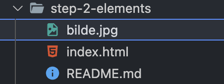

## Step 2 - legge til noen elementer

I dette steget skal vi legge til noen elementer:

- En underoverskrift
- Et avsnitt med tekst
- Et bilde

1. Åpne index.html
2. Legg til et `<h1>`-element med din egen tekst
3. Legg til et `<p>`-element med en lengre tekst
4. Legg til et ``-element med referanse til et bilde

- Det kan være greit å legge et bilde i samme mappe som index.html:
  

**Elementene er beskrevet nedenfor**

### Dersom du står fast

`index.html` i denne katalogen inneholder løsning om du står fast

[Videre til Steg 3 - flere sider](../step-3-pages/README.md)

## Litt om elementer

De fleste elementer følger samme oppbygning:

`<navn-på-element>`innhold`</navn-på-element>`

Vi kaller disse åpne-og-lukke tags

`<>  </>`

### Headings

```html
<h1>Overskrift</h1>
<h2>Underoverskrift</h2>
<h3>Under-underoverskrift</h3>
<h4>Under-under-underoverskrift</h4>
<h5>....-underoverskrift</h5>
<h6>etc</h6>
```

### Tekst

```html
<p>Avsnitt</p>

<span>Tekst som ikke opptar egen linje</span>

<b>fet tekst</b>

<i>kursiv tekst</i>
```

### Bilder

Img-elementet er ett av elementene som ikke har åpne-lukke tag par,

```html

```

### Link

```html
<a href="side-navn.html">Tekst</a>
```

### Container for andre elementer

```html
<div>{elementer her}</div>
<article></article>
<section></section>
```

### Knapp

```html
<button>Trykk her</button>
```

### Lister

```html
<ul>
  - betyr unordered list
  <li></li>
  - li står for list item
</ul>

<ol>
  - betyr ordered list (nummerert)
  <li></li>
  - li står for list item
</ol>
```
