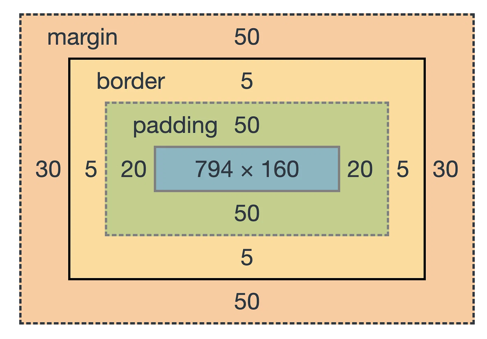

## Step 4 - styling

La oss legge til litt styling på siden vår.

1. Åpne index.html og gå til `<style>`-elementet i `<head>`

2. Legg til følgende CSS inn i `<style>`-elementet:

```css
body {
  background-color: white;
  font-family: "Arial";
  margin: 2em;
  color: #1f5373;
}

h2 {
  color: #f29bcb;
}

p {
  width: 600px;
  background-color: #a7d5f2;
  padding: 15px;
  border: solid 1px #1f5373;
}
```

3. Trykk lagre

4. Refresh nettleseren

### Forklaring av CSS-reglene

```css
body {
  background-color: white;
  font-family: "Arial";
  margin: 2em;
  color: #1f5373;
}
```

Alt inne i body:

- background-color: fargen skal være hvit
- font-family: fonten skal være Arial
- margin: utenfor boksen skal det være luft tilsvarende 2 linjehøyder
- color: teksten skal være fargen #1f5373

```css
h2 {
  color: #f29bcb;
}
```

Alle `<h2>`-elementer:

- color: teksten skal være fargen #f29bcb

```css
p {
  width: 600px;
  background-color: #a7d5f2;
  padding: 15px;
  border: solid 1px #1f5373;
}
```

Alle `<p>`-elementer:

- width: nøykatig 600 pixels bred
- background-color: bakgrunnsfargen skal være #a7d5f2
- padding: luft på innsiden av boksen skal være 15 pixels
- border: kanten rundt skal være solid, 1 pixel bred og fargen #1f5373

[Videre til Steg 5 - javascript](../step-5-javascript/README.md)

## Om CSS

Kan settes direkte på HTML-elementer ved hjelp av “style”

```css
<p style="color: blue;">This is a blue text.</p>
```

Vi kan ha egne filer (.css) vi linker til fra `<head>`

```html
<link rel="stylesheet" href="styles.css" />
```

Vi kan skrive CSS direkte i `<style>`-elementet i `<head>`

```html
<head>
  <style>
    p {
      color: red;
    }
  </style>
</head>
```

### Egenskaper vi kan benytte

_Grunnleggende egenskaper:_

- Tekst: font-family, font-size, color, text-align.
- Bakgrunn: background-color.
- Borders: border, border-radius.
- Mellomrom/luft: margin, padding.
- Størrelse: height, width

_Box model_:

Alle elementer har sin egen boks som kan ha

- margin (top, bottom, left, right)
- border (top, bottom, left, right)
- padding (top, bottom, left, right)
- width
- height



### Selectors

Nettleseren leser bruker CSS til å avgjøre hvilke regler som gjelder for hvilke elementer

I css kan man benytte seg av ulike selektorer (selectors) som i hovedsak er:

- element-type
- klasse
- ID

Element-type - alle elementer av typen for følgende regel

```css
p {
  background-color: grey;
}
```

Klasse - elementer annotert med klassenavnet får regelen

```css
.highlight {
  background-color: yellow;
}
```

Klassen benyttes slik:

```html
<p class="highlight">Tekst</p>
```

ID - benyttes for å markere ett unikt element

```css
#header {
  font-size: 24px;
}
```

ID settes slik:

```html
<p id="header">Denne teksten blir 24 pixels stor</p>
```
